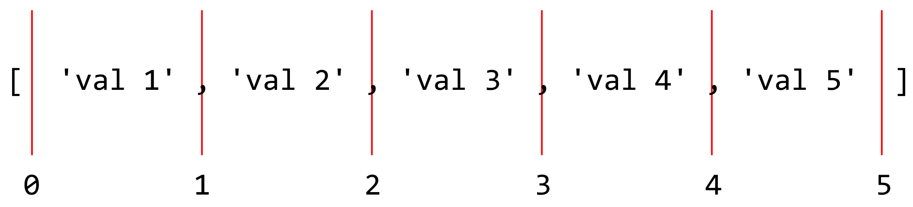

# Arrays

Arrays are one type of collection of other values. In JavaScript (and many other languages), individual items in an array are referenced with 0-based indexing. This means the first item in the array is item #0, the 2nd item is item #1, the 3rd item is item #2, and so on. It is useful to me to visualize arrays like this:



Referring to an index of the array above would refer to the value _after_ the given index (i.e., if the array above is called `arr`, then `arr[2]` is `'val 3'`), and slicing the array would refer to the values between the given indiceis (i.e., `arr.slice(1, 3)` is `['val 2', 'val 3']`).

Consider the following example:

```js
const planets2005 = [
  'Mercury',
  'Venus',
  'Earth',
  'Mars',
  'Jupiter',
  'Saturn',
  'Neptune',
  'Uranus',
  'Pluto',

  /*
    In 2005, astronomer Mike Brown and his team announced the discovery of 2003
    UB_313 (later named Eris after the Greek goddess of discord and strife), a
    trans-Neptunian object then thought to be just barely larger than Pluto.
    Soon afterwards, a NASA Jet Propulsion Laboratory press release described
    the object as the "tenth planet".
  */
  '2003 UB_313',
];

const reclassifyPlanets2006 = () => {
  /*
    2003 UB_313 was never officially classified as a planet, and the August 2006
    definition of planet defined both it and Pluto not as planets but as dwarf
    planets because they have not cleared their neighbourhoods. They do not
    orbit the Sun alone, but as part of a population of similarly sized objects.
    Pluto itself is now recognized as being a member of the Kuiper belt and the
    largest dwarf planet, larger than the more-massive 2003 UB_313.
  */
  const planets = planets2005.slice(0, 8);
  const dwarfs = planets2005.slice(8);

  /*
    The name "Eris" was proposed and assigned in September 2006, following an
    unusually long period in which the object was known by the provisional
    designation 2003 UB_313.
  */
  const erisIndex = dwarfs.indexOf('2003 UB_313');
  dwarfs[erisIndex] = 'Eris';

  return [planets, dwarfs];
}

const [planets2006, dwarfs2006] = reclassifyPlanets2006();
```

## References
- Array - Learn Web Development | MDN  
  https://developer.mozilla.org/en-US/docs/Learn/JavaScript/First_steps/Arrays